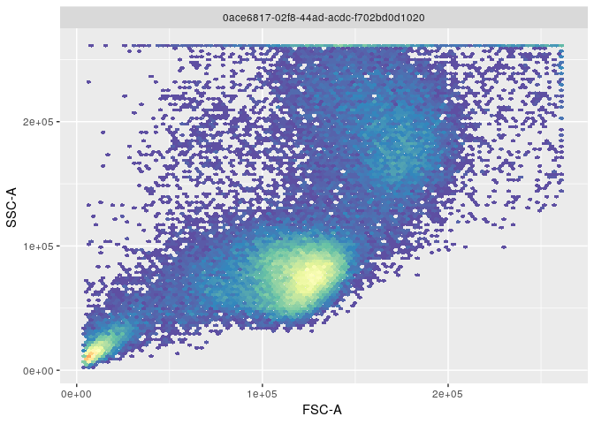
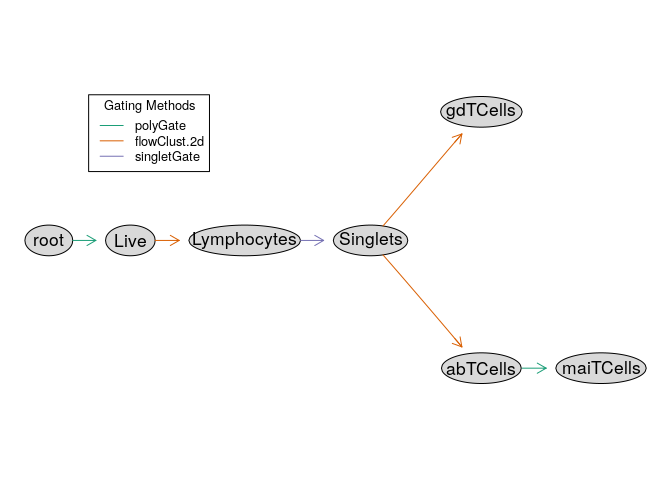
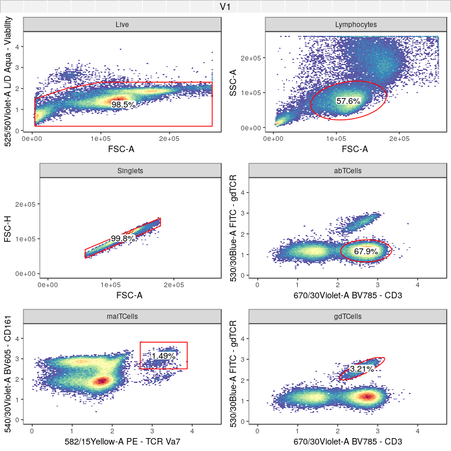

Flow Cytometry
==============

``` r
# Domain specific
library(FlowRepositoryR)
library(flowCore)
library(openCyto)
library(ggcyto)

# Tidyverse
library(fs)
library(readr)
library(dplyr)
library(purrr)
```

We'll examine the OMIP panel data available from [FlowRepository](https://flowrepository.org/), using the client library [FlowRepositoryR](https://bioconductor.org/packages/release/bioc/html/FlowRepositoryR.html), and demonstrate phenotypic differences between T cell types based on the protein expression levels captured in these assays.

To aid in identifying and visualizing these different cell populations, a variety of tools built on [flowCore](https://bioconductor.org/packages/release/bioc/html/FlowRepositoryR.html) will be used and in particular, [openCyto](https://bioconductor.org/packages/release/bioc/html/openCyto.html) will enable us to model and manipulate the workflows used in the OMIP publications to identify T cell types.

Exploring FlowRepository
------------------------

TBD

-   Attempt to show consolidated metadata from all OMIP datasets
-   This will likely need to involve downloading the data to demonstrate anything useful (i.e. which markers are present)
-   Show markers available by datasets relating to Human t-cells (not sure how to filter to human only yet)

Data from one paper
-------------------

Initial Example: [OMIP-021 Innate-like T-cell Panel (FR-FCM-ZZ9H)](https://flowrepository.org/id/FR-FCM-ZZ9H)

``` r
data_dir <- dir_create("data/flow")
dataset_id <- "FR-FCM-ZZ9H"
dataset_path <- fs::path(data_dir, dataset_id)
dataset <- flowRep.get(dataset_id)

if (!dir_exists(dataset_path)) 
  dataset <- download(dataset, dirpath=dataset_path, only.files="Donor.*fcs", show.progress=F)
fr <- read.FCS(fs::path(getwd(), dataset_path, 'Donor1.fcs'))
fr %>% exprs %>% data.frame %>% head(10) %>% knitr::kable(format.args = list(digits=3))
```

|   FSC.A|   FSC.H|   SSC.A|   SSC.H|  X450.50Violet.A|  X525.50Violet.A|  X540.30Violet.A|  X585.15Violet.A|  X610.20Violet.A|  X670.30Violet.A|  X670.14Red.A|  X730..45Red.A|  X780.60Red.A|  X530.30Blue.A|  X710.50Blue.A|  X582.15Yellow.A|  X610.20Yellow.A|  X670.30Yellow.A|  X710.50Yellow.A|  X780.60Yellow.A|  Time|
|-------:|-------:|-------:|-------:|----------------:|----------------:|----------------:|----------------:|----------------:|----------------:|-------------:|--------------:|-------------:|--------------:|--------------:|----------------:|----------------:|----------------:|----------------:|----------------:|-----:|
|  119565|  108322|   82937|   76142|             1130|              257|              630|             1002|             3625|             5465|          7061|          13215|          6966|          222.4|          17786|              803|              418|            20700|            29263|            19368|   136|
|  107004|   77596|  262143|  207144|             1223|              732|              995|              169|              721|              114|          1110|           8055|          2695|          420.8|            926|              358|              294|              851|            70563|             2586|   136|
|  214908|  139281|  262143|  226353|             3218|             1049|             2240|             1467|             7903|            10092|          8914|          26039|         10930|          561.1|          19171|              994|              733|            21668|            88813|            12031|   136|
|  119453|  107496|   67842|   62072|             2473|              351|             5828|            14664|            22003|             3548|          7316|           6115|           951|          112.0|           5504|              184|              448|             4450|            17505|             1143|   136|
|  122345|  111352|   62728|   56540|              541|              194|             2601|              735|             1267|             1095|          3060|           4466|          4531|           95.4|           5793|              435|              440|             8354|            16969|             3564|   137|
|  137030|  124521|   77133|   70557|             4062|              471|            10052|            23228|            41648|             6317|         13904|          15326|          2217|          152.7|           5801|              189|              829|            10039|            21626|             2003|   138|
|  153801|  122139|  122174|   80251|              924|              735|             2110|             1059|             2827|             2641|           287|           1277|           611|         4595.7|           6182|              175|              201|              822|            33043|             1301|   138|
|  177071|  145150|  168704|  148426|              731|              679|             1243|              337|             1045|              201|           415|           9995|          1659|          291.3|           1052|              271|              366|              570|            47515|              953|   138|
|  165853|  118245|  122113|   89253|             2785|              511|             7996|             2560|            15636|             9627|         10654|          29089|         14198|          337.8|          20733|             1203|             2341|            24269|            40187|            12859|   138|
|  121005|  108937|   72537|   66157|              255|              205|             3215|              724|             2316|              153|           361|            829|           141|          166.0|           4320|              335|              819|             1027|            21945|              244|   138|

In this dataset, one way to identify lymphocytes is by looking at modes in the relationship between side and forward scatter:

``` r
ggcyto(fr, aes(x='FSC-A', y='SSC-A')) + geom_hex(bins=100)
```



To identify the lymphocyte cells above, `openCyto` gating can be used to select the largest cluster of cells automatically and visualize what fraction of the population these cells constitute:

``` r
gate <- openCyto::flowClust.2d(fr, 'FSC-A', 'SSC-A', K=3, quantile=.9)
ggcyto(fr, aes(x='FSC-A', y='SSC-A')) + geom_hex(bins=100) + geom_gate(gate) + geom_stats()
```


#### Gating

By repeating the above process for all cell types of interest in the paper, the workflow can be reproduced via a [GatingTemplate](https://www.bioconductor.org/packages/devel/bioc/vignettes/openCyto/inst/doc/HowToWriteCSVTemplate.html) as shown below, which could also be built programmatically instead. The graphical representation of the template shows how cell types will be recursively defined based on 2 dimensional filters:

``` r
template <- 'alias,pop,parent,dims,gating_method,gating_args,collapseDataForGating,groupBy,preprocessing_method,preprocessing_args
Live,+,root,"FSC-A,525/50Violet-A","polyGate","x=c(0,3e5,3e5,1e5,.5e5,0),y=c(0,0,2.3,2.3,2,1.5)",,,,
Lymphocytes,+,Live,"FSC-A,SSC-A","flowClust.2d","K=3,quantile=.95",,,,
Singlets,+,Lymphocytes,"FSC-A,FSC-H","singletGate","maxit=1000,wider_gate=T,prediction_level=.999999999",,,,
gdTCells,+,Singlets,"670/30Violet-A,530/30Blue.A","flowClust.2d","K=3,target=c(2.5,2.5)",,,,
abTCells,+,Singlets,"670/30Violet-A,530/30Blue.A","flowClust.2d","K=3,target=c(2.5,1),quantile=0.95",,,,
maiTCells,+,abTCells,"582/15Yellow.A,540/30Violet.A","polyGate","x=c(2.7,5,5,2.7),y=c(2.5,2.5,5,5)",,,,'
template_path <- file_temp(ext='.csv')
write_lines(template, template_path)
gt <- gatingTemplate(template_path)
plot(gt)
```



The above template only outlines the gating workflow but to apply it to our data, these are the common steps:

-   Apply compensation to the raw FCS data if necessary (not necessary in this case as the authors did this beforehand)
-   Define channel transformations to make gating and visualization possible
-   Define any custom gating functions needed in the workflow, which is particularly useful for setting manual gates
-   Apply the gating template to the data at hand, which in this case is represented as a `flowFrame` but could also be a `flowSet` representing a collection of experiments

Here is the realization of these steps for this data specifically:

``` r
# Define logicle transformation for all fluorescent channels and build a "GatingSet", which is a wrapper
# class that binds numeric data with transformations and gating information
transformer <- transformerList(colnames(fr@description$SPILL), logicle_trans())
gs <- transform(GatingSet(flowSet(fr)), transformer)

# Define a custom polygon gating function, that is used in our template to deal with situations
# that are difficult to define an automated gate for
.polyGate <- function(fr, pp_res, channels, filterId="polygate", ...){ 
  args <- list(...)
  g <- data.frame(x=args$x, y=args$y)
  colnames(g) <- channels
  flowCore::polygonGate(.gate=g, filterId=filterId)
}
registerPlugins(fun=.polyGate, methodName='polyGate',dep=NA)

# Apply the gating to the data (this may take a couple minutes)
gating(gt, gs)
```

#### Results

Now that the workflow is finished, here is a look at all cell types identified:

``` r
autoplot(gs[[1]], strip.text = "gate", bins=100, merge=F, axis_inverse_trans=F) + flow_theme
```



This should then be comparable to what was in the [OMIP-021 publication](https://onlinelibrary.wiley.com/doi/full/10.1002/cyto.a.22475), and here are relevant figures demonstrating the similarity of the cell subsets captured:


