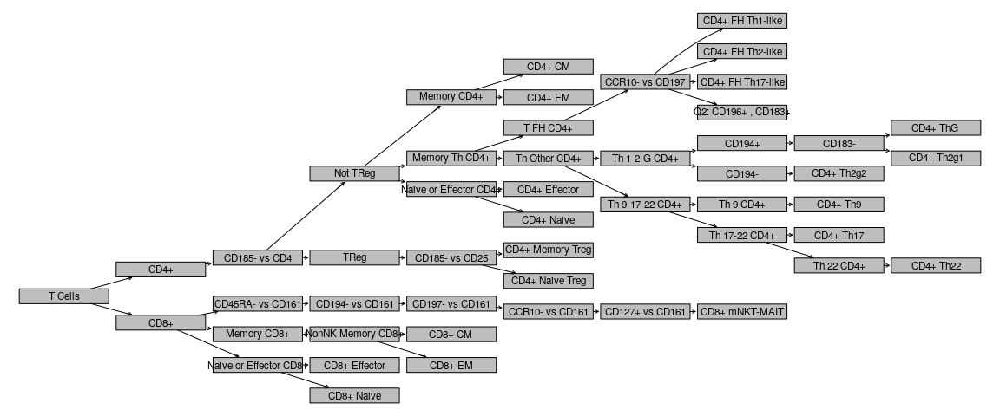
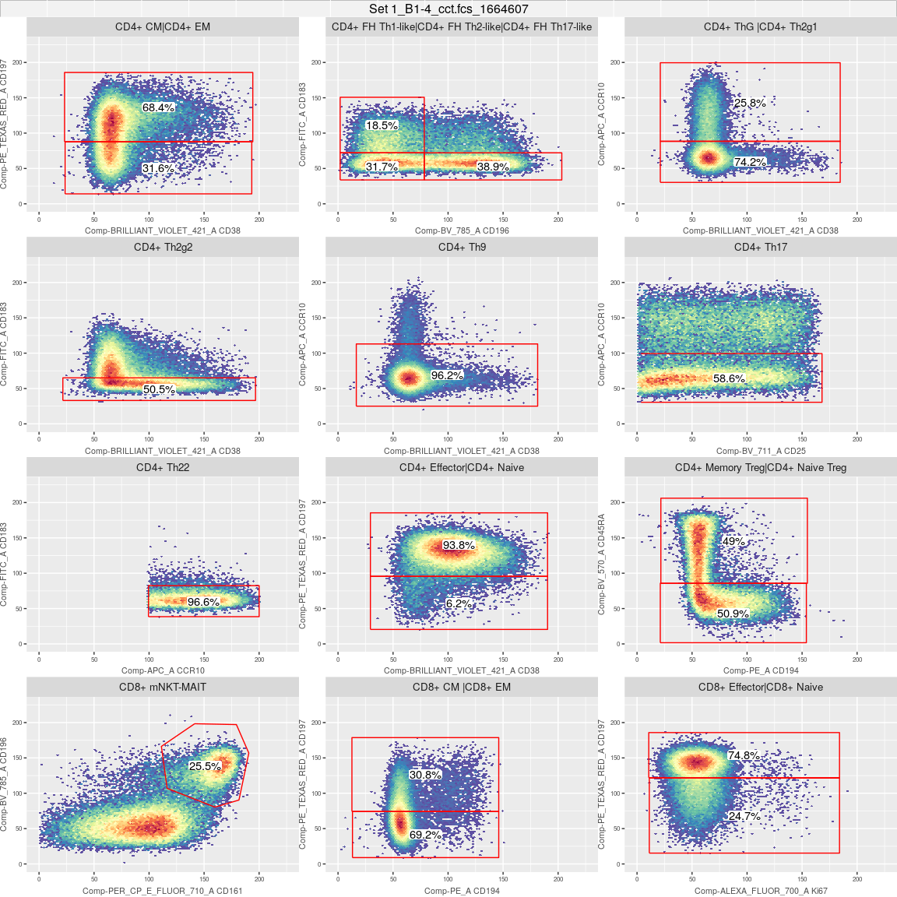
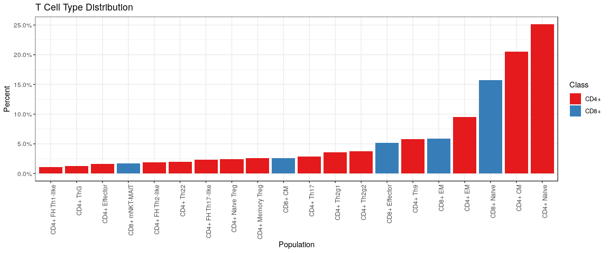
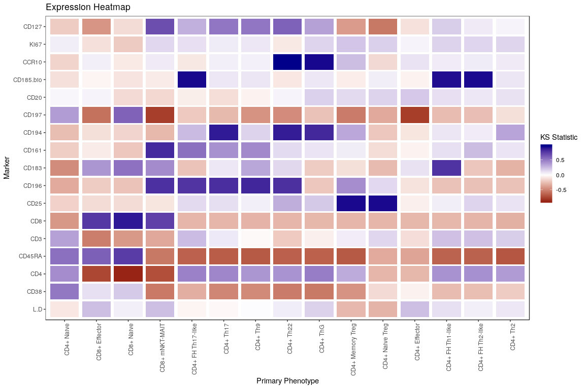
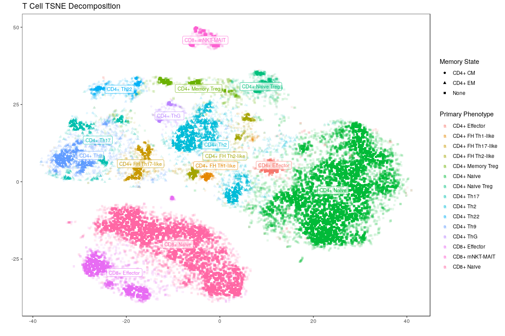

OMIP 030
========

``` r
library(magrittr)
library(tidyverse)
library(fs)
library(janitor)
library(FlowRepositoryR)
library(flowCore)
library(openCyto)
library(ggcyto)
library(Rtsne)
library(reshape2)

map <- purrr::map
add <- flowCore::add
filter <- dplyr::filter
```

Load a flow workspace, which will contain all gaiting and cell expression information:

``` r
ws <- openWorkspace('~/analysis/data/omip/omip-030/clean/OMIP_PBMC_clean.wsp')
gs <- parseWorkspace(ws, name='TCells', 
                     path='/home/eczech/analysis/data/omip/omip-030/clean', isNcdf=FALSE)
# Extract single GatingHierarchy from GatingSet
gh <- gs[[1]]
```

``` r
print(getData(gh))
```

    ## flowFrame object 'Set 1_B1-4_cct.fcs_1664607'
    ## with 1664607 cells and 22 observables:
    ##                             name      desc       range minRange
    ## $P1                        FSC_A      <NA> 262144.0000  0.00000
    ## $P2                        FSC_W      <NA> 262144.0000  0.00000
    ## $P3                        SSC_A      <NA> 262144.0000  0.00000
    ## $P4                        SSC_W      <NA> 262144.0000  0.00000
    ## $P5        Comp-LIVE_DEAD_BLUE_A       L+D    206.2050 50.70977
    ## $P6  Comp-BRILLIANT_VIOLET_421_A      CD38    206.2049 50.70982
    ## $P7                  Comp-V500_A       CD4    206.2050 50.70978
    ## $P8                Comp-BV_570_A    CD45RA    206.2050 50.70978
    ## $P9              Comp-QDOT_605_A       CD3    206.2050 50.70976
    ## $P10             Comp-QDOT_655_A       CD8    206.2049 50.70979
    ## $P11               Comp-BV_711_A      CD25    206.2049 50.70984
    ## $P12               Comp-BV_785_A     CD196    206.2050 50.70976
    ## $P13                 Comp-FITC_A     CD183    206.2050 50.70978
    ## $P14   Comp-PER_CP_E_FLUOR_710_A     CD161    206.2050 50.70976
    ## $P15                   Comp-PE_A     CD194    206.2050 50.70977
    ## $P16         Comp-PE_TEXAS_RED_A     CD197    206.2050 50.70977
    ## $P17             Comp-PE_CY5_5_A      CD20    206.2050 50.70976
    ## $P18               Comp-PE_CY7_A CD185-bio    206.2050 50.70976
    ## $P19                  Comp-APC_A     CCR10    206.2050 50.70978
    ## $P20      Comp-ALEXA_FLUOR_700_A      Ki67    206.2050 50.70977
    ## $P21              Comp-APC_CY7_A     CD127    206.2049 50.70979
    ## $P22                        TIME      <NA>  32768.0000  0.00000
    ##         maxRange
    ## $P1  262144.0000
    ## $P2  262144.0000
    ## $P3  262144.0000
    ## $P4  262144.0000
    ## $P5     256.9147
    ## $P6     256.9147
    ## $P7     256.9147
    ## $P8     256.9147
    ## $P9     256.9147
    ## $P10    256.9147
    ## $P11    256.9147
    ## $P12    256.9147
    ## $P13    256.9147
    ## $P14    256.9147
    ## $P15    256.9147
    ## $P16    256.9147
    ## $P17    256.9147
    ## $P18    256.9147
    ## $P19    256.9147
    ## $P20    256.9147
    ## $P21    256.9147
    ## $P22  32768.0000
    ## 298 keywords are stored in the 'description' slot

Plot the gating workflow starting from where T Cells are first identified:

``` r
plot(gs, 'T Cells', width=6, height=1, fontsize=18, shape='rectangle')
```



Identify terminal nodes in the workflow which were, by convention, named with either `CD4+` or `CD8+` prefixed to their population names:

``` r
all_nodes <- getNodes(gs, path=1)
cell_pops <- all_nodes %>% keep(str_detect(., '^CD[4|8]\\+ .*'))

not.is.na <- function(x) !is.na(x)
cell_pop_to_class <- function(x) case_when(
  str_detect(x, '^CD4\\+') ~ 'CD4+',
  str_detect(x, '^CD8\\+') ~ 'CD8+',
  TRUE ~ NA_character_
)
cell_pop_to_mem_state <- function(x) case_when(
  str_detect(x, '^CD[4|8]\\+ CM.*') ~ 'CM',
  str_detect(x, '^CD[4|8]\\+ EM.*') ~ 'EM',
  TRUE ~ NA_character_
)
  
cell_mem_types <- cell_pops[cell_pops %>% cell_pop_to_mem_state %>% not.is.na]
cell_pheno_types <- cell_pops %>% discard(~. %in% cell_mem_types)
```

Show the gating for terminal nodes, which correspond to specific cell types:

``` r
autoplot(gs[[1]], cell_pops, bins=100, strip.text='gate', axis_inverse_trans=FALSE) + 
  ggcyto_par_set(facet=facet_wrap(~name, scales='free'), limits = list(x=c(0, 225), y=c(0, 225)))
```



Plot the distribution of different cell types noting that the memory phenotype (CM vs EM) exhibited by CD4+ and CD8+ cells is considered independent of the other T-helper, Regulatory, Effector and Naive phenotypes. For example, this means that a Th17 cell can also exhibit CM or EM cell markers (or neither). Before separating these designations, this distribution will show how frequent each phenotype is regardless of co-occurrence:

``` r
cell_count <- getTotal(gh, 'T Cells')

cell_pop <- getPopStats(gs) %>% 
  filter(Population %in% cell_pops) %>% 
  select(Population, Count) %>% 
  arrange(Count)

cell_pop %>%
  mutate(Percent=Count/cell_count, Class=cell_pop_to_class(Population)) %>% 
  arrange(desc(Percent)) %>% 
  mutate(Population=fct_reorder(Population, Percent)) %>%
  ggplot(aes(x=Population, y=Percent, fill=Class)) +
  geom_bar(stat='identity') +
  scale_fill_brewer(palette='Set1') +
  scale_y_continuous(labels = scales::percent) +
  ggtitle('T Cell Type Distribution') +
  theme_bw() +
  theme(axis.text.x = element_text(angle = 90, hjust = 1)) 
```



Now assign a primary phenotype and a memory phenotype to each cell and show how frequently either occur together:

``` r
extract_node_assignment <- function(nodes) {
  nodes %>% map(~getIndices(gh, .)) %>% bind_cols %>% 
    set_names(nodes) %>% apply(., 1, function(x){
      if (sum(x) == 1) nodes[x] 
      else NA_character_
    })
}

df_cell_types <- list(pheno_type=cell_pheno_types, mem_type=cell_mem_types) %>% 
  map(extract_node_assignment) %>% as_tibble %>%
  mutate(class_type=cell_pop_to_class(pheno_type)) %>%
  mutate(pheno_type=case_when(
    pheno_type %in% c('CD4+ Th2g1', 'CD4+ Th2g2') ~ 'CD4+ Th2', 
    TRUE ~ pheno_type
  ))

df_cell_types %>% filter(!is.na(pheno_type)) %>% 
  mutate(mem_type=case_when(is.na(mem_type) ~ 'None', TRUE ~ mem_type)) %>% 
  tabyl(pheno_type, mem_type) %>% 
  adorn_totals('row') %>% adorn_totals('col') %>%
  adorn_percentages(denominator='all') %>% 
  adorn_pct_formatting(digits=2) %>%
  knitr::kable()
```

| pheno\_type       | CD4+ CM | CD4+ EM | CD8+ CM | CD8+ EM | None   | Total   |
|:------------------|:--------|:--------|:--------|:--------|:-------|:--------|
| CD4+ Effector     | 0.00%   | 0.00%   | 0.00%   | 0.00%   | 2.11%  | 2.11%   |
| CD4+ FH Th1-like  | 1.17%   | 0.22%   | 0.00%   | 0.00%   | 0.00%  | 1.39%   |
| CD4+ FH Th17-like | 2.64%   | 0.28%   | 0.00%   | 0.00%   | 0.00%  | 2.92%   |
| CD4+ FH Th2-like  | 1.97%   | 0.41%   | 0.00%   | 0.00%   | 0.00%  | 2.38%   |
| CD4+ Memory Treg  | 0.00%   | 0.00%   | 0.00%   | 0.00%   | 3.22%  | 3.22%   |
| CD4+ Naive        | 0.00%   | 0.00%   | 0.00%   | 0.00%   | 31.87% | 31.87%  |
| CD4+ Naive Treg   | 0.00%   | 0.00%   | 0.00%   | 0.00%   | 3.12%  | 3.12%   |
| CD4+ Th17         | 2.61%   | 1.03%   | 0.00%   | 0.00%   | 0.00%  | 3.64%   |
| CD4+ Th2          | 7.52%   | 1.74%   | 0.00%   | 0.00%   | 0.00%  | 9.26%   |
| CD4+ Th22         | 1.23%   | 1.26%   | 0.00%   | 0.00%   | 0.00%  | 2.48%   |
| CD4+ Th9          | 3.82%   | 3.50%   | 0.00%   | 0.00%   | 0.00%  | 7.32%   |
| CD4+ ThG          | 1.14%   | 0.44%   | 0.00%   | 0.00%   | 0.00%  | 1.58%   |
| CD8+ Effector     | 0.00%   | 0.00%   | 0.00%   | 0.00%   | 6.59%  | 6.59%   |
| CD8+ mNKT-MAIT    | 0.00%   | 0.00%   | 0.11%   | 0.14%   | 1.93%  | 2.18%   |
| CD8+ Naive        | 0.00%   | 0.00%   | 0.00%   | 0.00%   | 19.93% | 19.93%  |
| Total             | 22.11%  | 8.87%   | 0.11%   | 0.14%   | 68.78% | 100.00% |

Given the above information, we're ready to extract the raw marker intensity data and attach enough cell metadata to it to do something useful:

``` r
# Create data frame with measurments and phenotype information
fr <- getData(gh)
name_map <- parameters(fr)@data %>% filter(str_detect(name, 'Comp'))
name_map <- set_names(name_map$name, name_map$desc)
df <- fr %>% exprs %>% as_tibble %>% 
  select(starts_with('Comp')) %>% 
  rename(!!name_map) %>%
  cbind(df_cell_types) %>%
  filter(!is.na(pheno_type))

df %>% head(10) %>% knitr::kable()
```

|        L+D|       CD38|        CD4|     CD45RA|       CD3|        CD8|       CD25|      CD196|     CD183|      CD161|     CD194|      CD197|         CD20|  CD185-bio|     CCR10|      Ki67|      CD127| pheno\_type      | mem\_type | class\_type |
|----------:|----------:|----------:|----------:|---------:|----------:|----------:|----------:|---------:|----------:|---------:|----------:|------------:|----------:|---------:|---------:|----------:|:-----------------|:----------|:------------|
|   63.15968|  100.65498|   74.11814|  193.69416|  145.1010|  171.20775|   6.366209|   55.51362|  69.09519|   77.87564|  36.07406|  144.23314|   17.6651554|   67.89250|  47.44592|  78.66415|   98.65700| CD8+ Naive       | NA        | CD8+        |
|  105.65273|   67.19123|   55.52768|  173.23486|  160.1456|  167.54243|  98.193873|   51.18048|  74.70244|   43.05762|  41.78613|  137.83219|   46.6119835|   90.48832|  49.57621|  42.70296|   81.07022| CD8+ Naive       | NA        | CD8+        |
|   68.13003|   79.19564|   97.35362|  171.82771|  150.9526|  170.99518|  21.293473|   76.93865|  79.23445|   93.30119|  44.04389|  150.48561|    4.9409572|   70.78807|  59.10822|  61.49172|  120.13970| CD8+ Naive       | NA        | CD8+        |
|   78.37794|   71.05978|  103.24777|  201.50185|  128.7182|  171.34473|  55.754356|   44.83255|  74.42933|   52.87316|  40.52848|   78.21831|   21.2418998|   51.39526|  40.32743|  46.35410|   98.64925| CD8+ Effector    | NA        | CD8+        |
|  103.42857|  114.10314|  168.34281|   61.37263|  163.2715|   52.61338|  39.974980|   26.13579|  62.77339|  103.59936|  65.13380|  120.68530|   -1.9900431|   96.89013|  58.93377|  66.97854|   91.51768| CD4+ Th2         | CD4+ CM   | CD4+        |
|   58.73235|  117.71757|  171.73494|  128.09743|  172.3580|   71.21534|  23.976412|   40.83029|  50.27593|  108.70916|  54.82520|  127.53846|  -10.1216480|   84.21025|  50.59675|  62.22211|  112.22940| CD4+ Naive       | NA        | CD4+        |
|   78.40182|   60.38969|  159.26622|   71.94418|  138.2115|   50.87339|  54.629205|  109.06641|  80.03267|  125.54243|  83.71821|   65.25643|   41.2463000|   74.01168|  65.02410|  49.46866|  125.35435| CD4+ Th17        | CD4+ EM   | CD4+        |
|   41.43253|  103.87296|  167.86806|  166.19280|  153.2279|   51.67805|  26.431483|   36.95071|  48.80786|   85.30650|  46.82118|  105.81914|   16.4379383|   74.89422|  60.07392|  64.44350|   87.08237| CD4+ Naive       | NA        | CD4+        |
|   45.29608|  128.24395|  174.84853|   58.45242|  170.4359|   69.15590|  18.134742|   75.98104|  79.00436|  119.86107|  69.08827|  133.14677|   -0.3453205|  132.63079|  64.35668|  73.99091|   96.74911| CD4+ FH Th1-like | CD4+ CM   | CD4+        |
|   57.33911|   60.26151|  174.66047|   63.09577|  157.0219|   58.99010|  94.957015|   35.16060|  59.42250|   66.55918|  98.76253|  154.89565|   41.2596681|   94.51045|  62.56907|  58.67017|  114.02681| CD4+ Th2         | CD4+ CM   | CD4+        |

Now that the data is in a convenient form, one way to analyze this is to look at how well any one marker works to separate a primary phenotype from all others. Below, a Kolmogrov Smirnov statistic signed by median difference is used where for any one marker, all cells of a specific primary phenotype are compared to all cells of a different phenotype to give an overall sense of magnitude and direction of the separation:

``` r
dfg <- df %>% group_by(pheno_type) %>% do({
  d <- .
  dp <- df %>% filter(pheno_type != d$pheno_type[1]) %>% select_if(is.numeric)
  dt <- d %>% select_if(is.numeric)
  assertthat::are_equal(colnames(dp), colnames(dt))
  stats <- lapply(colnames(dp), function(col) {
    x <- pull(dt, col)
    y <- pull(dp, col)
    ksr <- ks.test(x, y)
    sign(median(x) - median(y)) * ksr$statistic[[1]]
  })
  names(stats) <- colnames(dp)
  data.frame(stats)
}) %>% ungroup

hc <- dfg %>% select_if(is.numeric) %>% 
  as.matrix %>% dist %>% hclust
dfg %>% melt(id.vars='pheno_type') %>% 
  mutate(pheno_type=factor(pheno_type, levels=dfg$pheno_type[hc$order])) %>% 
  ggplot(aes(x=pheno_type, y=variable, fill=value)) +
  geom_tile(width=0.9, height=0.9) + 
  scale_fill_gradient2(
    low='darkred', mid='white', high='darkblue', 
    guide=guide_colorbar(title='KS Statistic')) +
  flow_theme + 
  theme(axis.text.x = element_text(angle = 90, hjust = 1)) +
  xlab('Primary Phenotype') + ylab('Marker') + 
  ggtitle('Expression Heatmap')
```



TSNE decomposition shows how much more readily some phenotypes separate from others:

``` r
set.seed(1)
df_samp <- df %>% sample_n(15000)
tsne <- df_samp %>% select_if(is.numeric) %>% as.matrix %>% Rtsne

df_tsne <- tsne$Y %>% as_tibble %>% 
  cbind(df_samp %>% select(pheno_type, mem_type, class_type)) %>%
  mutate(mem_type=case_when(is.na(mem_type) ~ 'None', TRUE ~ mem_type))

get_density <- function(x, y){
  d <- densCols(x, y, colramp = colorRampPalette(rev(rainbow(10, end = 4/6))))
  col2rgb(d)[1,] + 1L
}

plot_tsne <- function(df){
  df_ctr <- df %>% group_by(pheno_type) %>% 
    summarize(cx=median(V1), cy=median(V2)) %>% ungroup
  df_pt <- df %>% group_by(pheno_type) %>% 
    mutate(dens=get_density(V1, V2), mem_type=mem_type[1]) %>% ungroup 
  
  ggplot(NULL) + 
    geom_point(data=df_pt, aes(x=V1, y=V2, color=pheno_type, alpha=dens, shape=mem_type)) +
    geom_label(data=df_ctr, aes(x=cx, y=cy, color=pheno_type, label=pheno_type), size=3, alpha=.7) +
    flow_theme
}

df_tsne %>% plot_tsne +
  # Add axis/legend/figure titles
  ggtitle('T Cell TSNE Decomposition') +
  guides(
    colour = guide_legend(title='Primary Phenotype'), 
    shape = guide_legend(title='Memory State'), 
    alpha = 'none'
  ) + xlab('') + ylab('')
```


